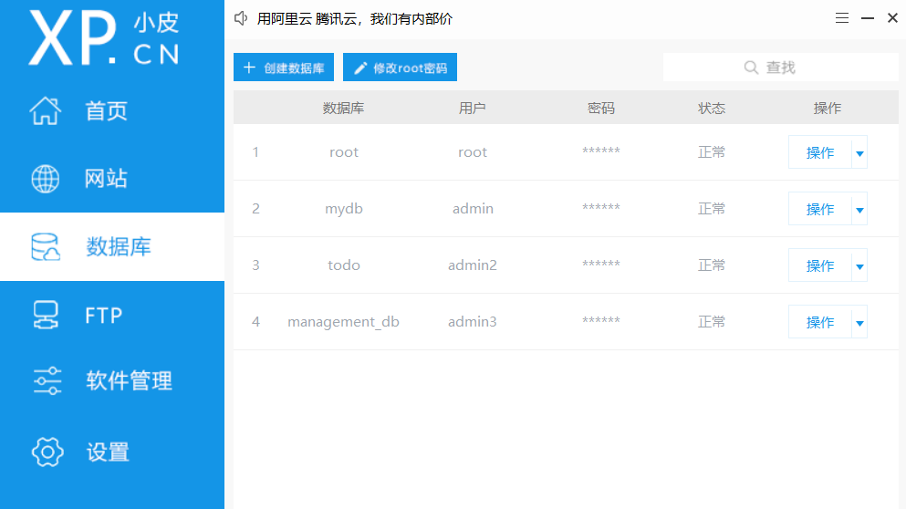
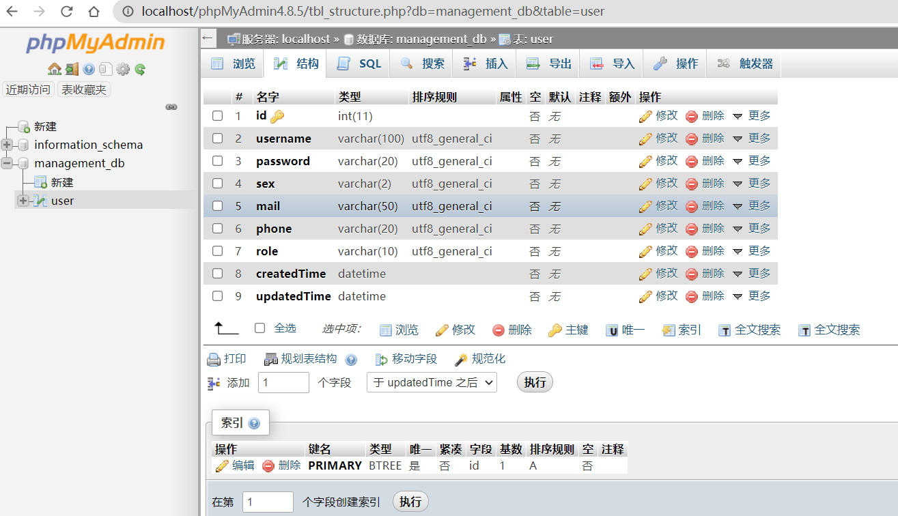
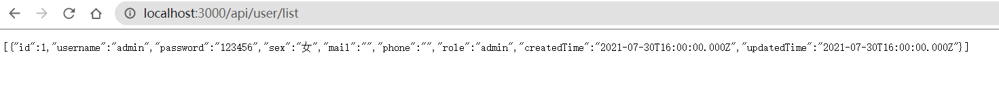

1.  安装 phpStudy 集成开发环境
2.  在 phpStudy 中创建数据库 management_db，启动 mysql
    
    启动 Apache 或 Nginx 打开数据库工具 phpMyAdmin，创建 user 表
    

3.  express 生成器快速生成项目

```
npx express-generator
```

4.  连接 mysql

- 安装 mysql

```
npm install mysql --save
```

- 数据库配置

  根目录下新建 server 文件夹，server 下新建 db.js

```
// server/db.js
module.exports = {
  mysql: {
    host: "localhost",
    user: "admin3",
    password: "123456",
    database: "management_db",
    port: "3306",
  },
};
```

- 连接数据库

  在 server 文件夹下新建 user.js

```
// server/user.js
var dbConfig = require("../db"); // 引入数据库配置
var express = require("express");
var router = express.Router();
var mysql = require("mysql");
// 连接数据库
var conn = mysql.createConnection(dbConfig.mysql);
conn.connect(function (err) {
    if (err) {
    console.log("[connect error]:" + err);
    return;
    }
    console.log("[connect succeed]");
});
// 路由
router.get("/list", (req, res) => {
    var sql = "select * from user";
    conn.query(sql, function (err, result) {
    if (err) {
        console.log("err", err);
    }
    if (result) {
        jsonWrite(res, result);
    }
    });
});
var jsonWrite = function (res, ret) {
    if (typeof ret === "undefined") {
    res.json({
        code: "1",
        msg: "操作失败",
    });
    } else {
    res.json(ret);
    }
};
module.exports = router;
```

- 在 app.js 中 引入 user.js

```
const userApi = require("./server/api/user");
app.use("/api/user", userApi);
```

5.  启动

```
npm start
```

访问 http://localhost:3000/api/user/list

